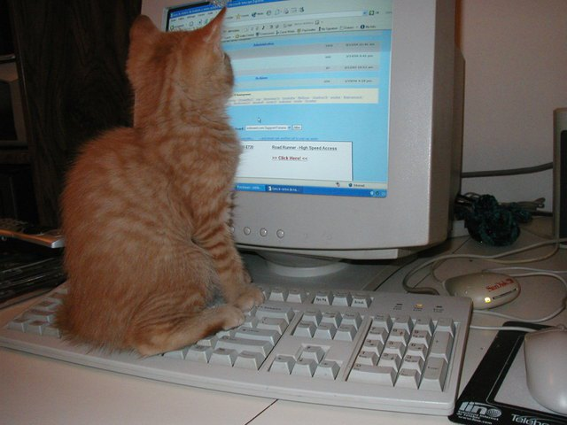

This is part 1 of a 4 part series I'm writing on all the concepts you need to
get started as a web developer. I'm going to try to explain everything
you need to get from here:

01010101011101000101011....

to here:

If you already know all about character sets and encoding/decoding them, you 
can probably skip to [part 2](network.html), where I try to explain HTTP.

****

# Part 1: Encoding and Decoding

To a computer, everything is a one or a zero. To a human, they're.. not.

So how do ones and zeros become characters on the screen?

You need to start by choosing a convention to interpret the 1s and 0s as 
characters. The convention you choose is entirely arbitrary. Writing something in
the format you choose is called encoding, and reading it is called decoding. As
long as your encoders and decoders (and, hopefully, you) are all on the same 
page about what they mean, everything is great.

The easiest way to do encoding is to take a fixed number (say, n) of ones or 
zeros at a time (I'm getting tired of saying "ones or zeros", so we'll start 
calling a single one or zero a "bit", because that's the technical name for it)
which can encode up to 2^n different things.

If you're working with English, there's 26 letters in the alphabet. That means
that you need to choose an n of at least 5 (2^5=32) to let you encode all the 
letters of the alphabet and that leaves you with 6 numbers left over that you 
can encode spaces or punctuations or accents or anything else you want, but this
only gives us enough space to store either uppercase letters or lowercase
letters but not both. 

If we choose n of 6, we have 64 numbers to work with. That let's us encode
uppercase letters, lowercase letters, but only leaves 12 numbers for us to 
encode digits, punctuation, accented letters, etc.

n of 7 gives us 128 numbers to work with. That lets us encode uppercase
letters, lowercase letters, digits, and leaves 66 numbers left over to
encode accents, punctuation, space, et cetera.

For most of computer history, [ASCII](http://www.asciitable.com) was the most
common character encoding in the English speaking world. It was a 7-bit 
character encoding system. It used some of the left over numbers to
include special characters that give commands to the computer with a keyboard,
such as backspace to tell the computer to delete the previous character, or 
"bell" to tell the computer to beep.

Computers don't usually operate on the ones and zeros directly, they like to
work on a number of them at a time to streamline things. The smallest unit that
they'll work on easily is called a "byte." Once upon a time there were some
weirdo computers with different sized bytes, but today pretty much everyone
considers a byte to be 8 bits. (This is one reason you often see numbers that
are multiples of 8 before the prefix -bit in computer terms and will probably
never see, say, "a 77-bit console" from Nintendo.)

So if your average computer is going to read 8-bits at a time, we might 
as well choose n=8 for our encoding instead of n=7. In fact, that's what 
"extended ASCII" is, where they used the extra bit to add some accents and 
greek letters and little symbols that can be used to draw ASCII art because 
why not?

This is all well and good if you speak a European based language, but
what if you're Japanese or Korean or Indian and you want to write something
in your native tongue? You'll need to come up with a completely different
convention and use that and then our computers won't be able to talk to
each other.

This is, in fact, what happened, and all these languages (and more) have
different interpretation schemes, called "character sets" and no computer
can interpret any file without knowing what character set it's written in.

After the internet started taking off, this became a bigger problem and someone
said to themselves "adding digits to how many bits we use grows the number
of possibilities exponentially. Why don't we choose an n large enough to
handle *all the languages*?" and unicode was born (uni- for one, and code
for.. code.)

It turns out you don't need *that* many bits, since each bit you add grows the
number of possibilities exponentially. With less than 32-bits (4 bytes) you can
include all the letters in all the languages in the world, and that leaves you
a lot to spare for things like punctuation or special typographic characters
that you've never heard of like em-quad or en-quad. So they did, came up with a
mapping for all the languages, and if you interpret 32 bits as a number
from 0 to 2^32-1 with this mapping it's called UTF-32.

The problem with doing that is that you used to use a byte to represent
a character in a word, and if you convert everything to 4 bytes, you're 
quadrupling the size of every text file on your hard drive, and downloading 
any web page will take 4 times as long and a lot of people aren't willing to
make that compromise just for the theoretical advantage of being able to write
any letter in any language inside the same file, except maybe people who write
multi-lingual dictionaries for a living. 

So another clever person came along and said "the original ASCII encoding,
which most computer protocols and files were built on, was 7-bits. Why don't
we start with that, and instead of extended ASCII, if the 8th bit in a byte is 0,
interpret it the same way that ASCII did, but if the 8th bit is 1 interpret it
as a control meaning 'read more bytes!' to make a variable length encoding?"

So they came up with a clever way of using a variable number of bytes to
encode a character, wrote out their convention, and called it "UTF-8."

The variable byte encoding means that you make some sacrifices like not
being able to jump to an arbitrary letter in a string without reading
the whole string from the start, but that's a compromise that most people are a
lot more comfortable with than being 4x more inefficient than before.

It doesn't happen so much anymore now that UTF-8 is ubiquitous, but when you 
used to get weird characters showing up in your web page, it was generally
because the computer guessed the wrong encoding on a page (or your font
didn't include a representation of that character encoded.)

(There's also UTF-16 which is a variable byte encoding used by Java and a couple
other programming languages, but outside of that isn't widely used since UTF-8
is usually a better option. Due to a bug in UTF16's design, UTF16 can only 
encode 2^21 codepoints, which means practically speaking unicode is limited
to that many codepoints even if UTF-32 and UTF-8 can handle more, but luckily
that's still enough to encode every human language and more.)

****

Images, or pictures, are just a different encoding of 1s and 0s.

Let's say you know the size of your image, divide it into dots (or "pixels")
and assign each pixel a colour. Let's encode that colour as a combination
of computer primary colours: red, blue, and green. (They're not the same ones
you were taught in school, but they're the components that a pixel on a screen
are made of, and they can still be combined to make any colour.) We'll use one
byte (0-255) for each. We'll just sequentially write red, blue, green for the
first pixel, red, blue, green for the second, red, blue, green for the third, 
etc until we get to the end of a line, then repeat for the next line of pixels.

This is called a "bitmap" image (the "BMP" files that come from MS Paint)
and isn't widely used as a file format (though it's generally how graphics
cards represent the screen inside of the video card's memory), but goes to show
that it's all just a matter of how you choose to interpret the 1s and 0s.

(When there's a 4th byte per pixel, it's generally used to represent
transparency in what's called an "alpha channel.")

JPEGs, GIFs, and PNGs are much more clever and efficient, but really just a 
different encoding/decoding algorithm of the 1s and 0s that a computer uses
which can represent the pixels in less space.

****

This is a lot more words than I wanted to write for part 1, but a web
developer really needs to know about character sets, because misinterpreting
a sequence of bytes from somewhere (the database, another web site, a file,
etc) is a common and frustrating way for things to go wrong, and at some
point in your career you'll have to deal with it.

And besides, knowing how bits become characters (and by implication, words 
if they're separated by a space character) is going to be basic background 
information for parts 2 and 3.
